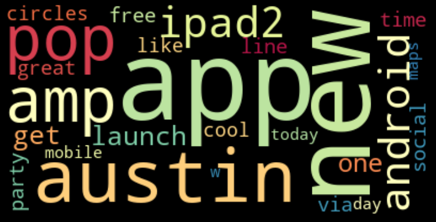
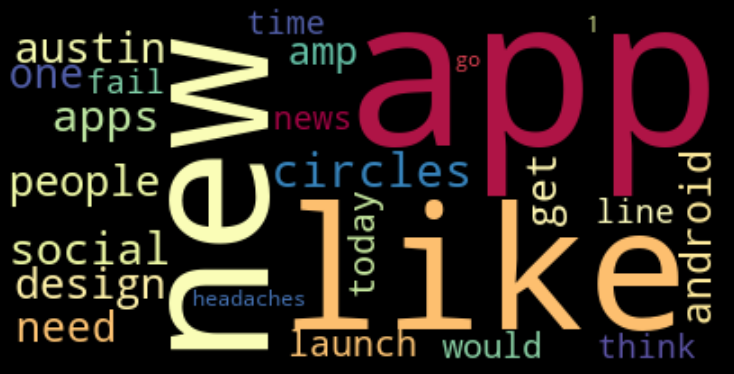
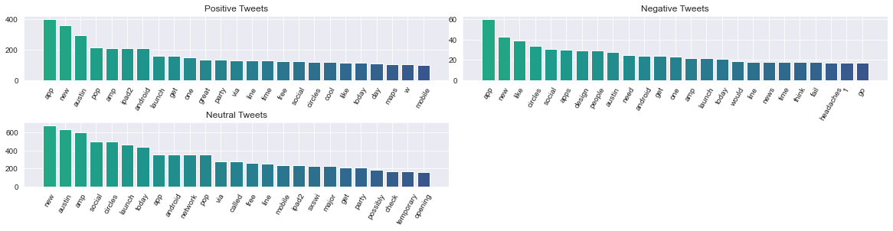
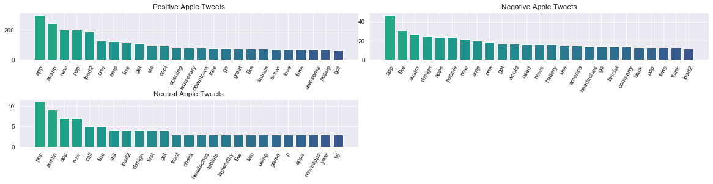
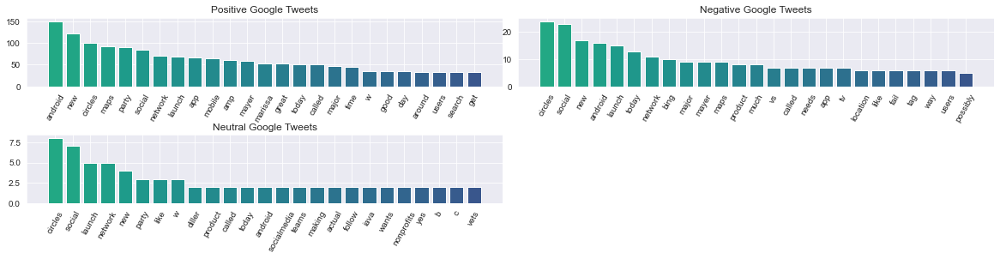
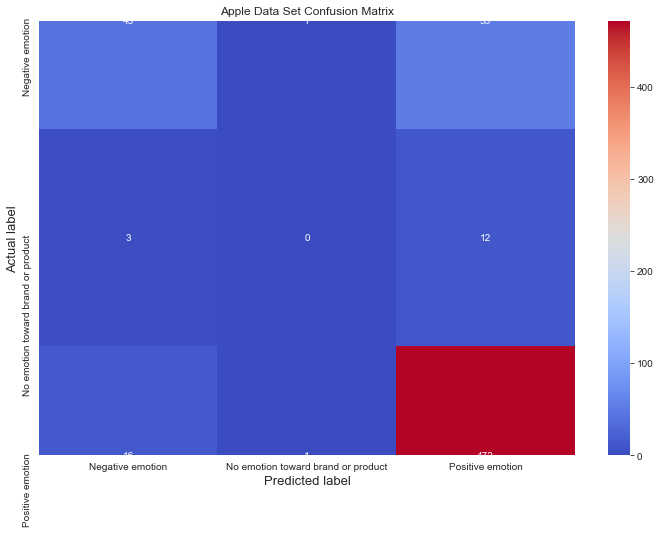
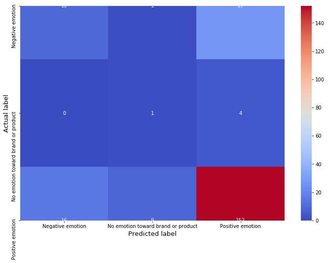

# Project 3: Multi-Classification
### Authors: Alex Zieky, Ben Spilsbury, and David Shin


## Overview

In order to further expand and develop our brand and its products, we believe it is crucial to analyze user feedback on social media outlets such as Twitter. 

## Business Problem

The data science team has been tasked with creating a predictive model to determine the emotional sentiment behind tweets. The subjects of the tweets are Google and Apple products, and sentiment is largely classified binarily (tweets are defined as positive, negative, or neutral). By leveraging Natural Language Processing, the team analyzes specific word presences in each tweet in order to evaluate the author's emotional valence. The final model, then, is able to help evaluate overall group sentiment towards companies Apple and Google, along with some of their respective products.

## Data

We utilized a dataset from CrowdFlower that has over 9,000 Tweets about Apple and Google products.
*  https://data.world/crowdflower/brands-and-product-emotions

## Method

### Initial Data Setup

Drop ambiguous data and divide into each respective brand. We then tokenized our dataset and dropped any stop-words.

### Exploratory Data Analysis

In our notebook, we created wordclouds to show the top words in both the Positive and Negative sentiment.




We also identified top words in the dataset for each classification of sentiment.




We then went more in detail and identified the top words in the dataset by brand and by sentiment.







### Models

Our initial models were created using only a Positive/Negative classifier. Later, we ran a Multi-Class Text Classification model that could classify a Tweet as one of the three classes (Positive, Negative, No Emotion). We ran through various models to optimize for F1 and Accuracy and our SVC model proved to be the highest performing model. We also created confusion matrixes for all of our data by total data set and by brand to see where our inaccuracies were stemming from.





### Evaluation

We evaluated our models for both Accuracy and F1 scores. We looked into Accuracy initially because in the context of Tweet classification, wrongly classifying Tweets into Positive or Negative sentiments didn't pose as a critical issue. We also utilized F1 score due to the imbalance in our dataset of Positive/Negative/No Emotion Tweets.

## Conclusions

Overall, a reasonably well model and representation of the data is achieved by partitioning the data set by company (Apple and Google) and using linear SVC analysis. Models for constituent companies produced an average accuracy of 86% and F1-Score of around 52% across all sentiment classes. These models outperform the model created for the entire data set, which only achieved an accuracy of 67% and an F1-Score of ~54%. They also outperformed a dummy model that blindly predicted the majority class, which achieved an accuracy of 81% and an average F1-Score of 30% across all classes.

Analysis is mainly hampered by two factors. The first is a large degree of class imbalance within the data. To improve in future model iterations, it is advised that tweet data is collected in a more unbiased manner; the high degree of positive tweets for both Apple and Google is likely due to the fact that tweets were created for a festival promotional event, wherein it appears that free products were being given out to participants. Data points should ideally be collected over a longer period of time and should be independent of one another (i.e. they shouldn't have all been written on account of the same event).

The second factor hampering performance is the lack of the models' ability to rightfully weight certain tokens that reverse a tweet's meaning (as in the example where the presence of 'not' changed the true meaning of a tweet from positive to negative). Such an analysis would consider such words not necessarily as parts of larger bigrams, but as unique unigrams that reverse the valence of other nearby unigrams (like 'popular' in the analyzed example).
## Further Research

For further development of our models, we can continue to branch out into other brands. It also looks like a majority of this data was from a particular event during SXSW, so taking Tweets from a larger span of time may help to improve our model accuracy. 

```
## Navigation
├── images
│   ├── applematrix.png
│   ├── fullmatrix.png
│   ├── googlematrix.jpg
│   ├── negapple.png 
│   ├── neggoogle.png
│   ├── negtweet.png
│   ├── negwordcloud.png
│   ├── neutapple.png
│   ├── neutgoogle.png
│   ├── neuttweet.png
│   ├── posapple.png
│   ├── posgoogle.png
│   ├── postweet.png
│   └── twitter.png
└── Tweet_NLP_Analysis.ipynb

